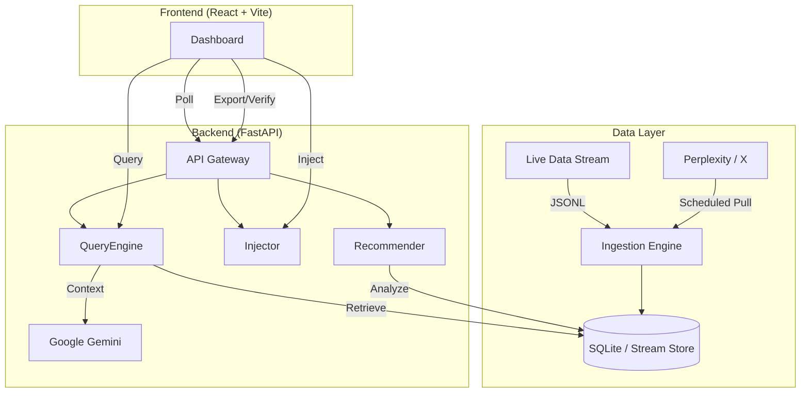

# ⚡ SiliconPulse (DataQuest 2026)

> **Real-time Strategic Intelligence for the Semiconductor & AI Era.**  
> *Powered by Gemini 1.5 Pro & Live Signal Processing.*


---

## 📖 What is SiliconPulse?
**SiliconPulse** is a real-time strategic intelligence engine designed to decode the chaotic semiconductor and AI market. It aggregates live signals (news, social, market data), grounds them in verified evidence, and uses **Google Gemini** to synthesize executive-level strategic insights instantly.

Unlike static dashboards, SiliconPulse is **reactive and intent-aware**—it understands the strategic implications of a "TSMC yield drop" or an "NVIDIA Blackwell delay" and explains *why* it matters, backed by a dynamic confidence assessment.

---

## 🎯 Problem Statement Fit (DataQuest 2026)
**Challenge:** "Building Intelligent Systems for Real-time Decision Making."

SiliconPulse addresses the **information overload** in the fast-moving tech sector by implementing:
- **RAG / Live Intelligence:** We don't just search; we retrieve live events from a streaming pipeline and perform **Retrieval Augmented Generation (RAG)** to generate fresh insights.
- **Dynamic Grounding:** Every AI claim is backed by specific, clickable evidence from the live feed.
- **Real-time Reasoning:** The system adapts its analysis the moment a new signal is injected, providing up-to-the-minute strategic outlooks.
- **System Design:** A robust decoupled architecture with a FastAPI gateway, background schedulers, and a high-performance React frontend.

---

## 🚀 Key Features

### 1. 📡 Live Pulse Feed
A real-time ticker of market signals. It ingests data from simulated and live sources (Perplexity, X) and deduplicates it on the fly with a 12-hour freshness window.

### 2. 🧠 Strategic Insight Engine
Powered by **Gemini**, this engine takes raw signals and generates a structured report:
- **What Changed:** Immediate market shifts.
- **Impact Reasoning:** Second-order effects (e.g., how Intel's loss affects AMD).
- **Confidence Meter:** A dynamic assessment of data reliability based on evidence count, recency, and source trust.

### 3. 🎯 Company Radar
Visual tracking of activity levels for top tech giants (NVIDIA, TSMC, Apple, etc.). Instantly spot who is making waves in the current data stream.

### 4. 💉 Inject Signal (Demo Mode)
**Judge Favorite:** Manually inject a custom news event into the live stream to test the system's reactivity. Watch the AI adapt its analysis instantly.

### 5. ✅ Verify Sources & Export (End-to-End)
- **Source Verification**: Instantly verify the credibility of AI claims. The system assigns trust levels (e.g., "High" for Reuters/Bloomberg, "Low" for Unverified Social) and provides a specific reason for each trust score.
- **Multi-Format Export**: Download your strategic analysis in **Markdown**, **JSON**, or **Text**. Choose whether to include the raw evidence items for a complete audit trail.

### 6. 🎬 Cinematic UI
A premium, high-fidelity interface featuring a deep radial gradient, tech-grid overlay, and cyan/indigo atmospheric glows for a state-of-the-art "Command Center" feel.

---

## 🏗️ Architecture Overview

SiliconPulse uses a decoupled architecture designed for high-velocity data.



### Request Flow:
1.  **Poll**: Frontend polls `/api/signals` every 5s to update the live feed.
2.  **Query**: User submits a query -> Backend retrieves relevant evidence from the JSONL stream using synonym expansion.
3.  **Synthesize**: Evidence is passed to Gemini with a strategic prompt -> Structured JSON report is generated.
4.  **Inject**: User injects a signal -> Backend appends to stream -> Next query immediately includes this new data.

---

## 🛠️ Tech Stack

- **Frontend**: React 18, Vite, Tailwind CSS, Lucide Icons, Framer Motion.
- **Backend**: FastAPI (Python 3.10+), Uvicorn, APScheduler.
- **AI/LLM**: Google Gemini 1.5 Flash (Primary) & 1.5 Pro (Fallback).
- **Data/Storage**: JSONL (Streaming format), SQLite (Deduplication & Metadata).
- **APIs**: Perplexity AI, X (Twitter) API.

---

## 📂 Folder Structure

```text
siliconpulse/
├── backend/
│   ├── app/
│   │   ├── routes.py       # API Endpoints
│   │   ├── models.py       # Pydantic Schemas
│   │   ├── services/       # Gemini Client
│   │   ├── sources/        # Perplexity & X Integrations
│   │   └── utils.py        # Confidence & Signal Logic
│   ├── data/               # Live stream.jsonl & SQLite DB
│   └── main.py             # FastAPI Entry Point
├── frontend/
│   ├── src/
│   │   ├── components/     # UI Components (Radar, Insight, etc.)
│   │   ├── api/            # API Client (Axios)
│   │   └── App.tsx         # Main Dashboard Logic
│   └── index.html          # Entry Point
└── README.md               # You are here
```

---

## ⚙️ Setup & Run Instructions

### Prerequisites
- Python 3.10+
- Node.js 18+
- Google Gemini API Key

### 1. Backend Setup
```powershell
cd backend
python -m venv venv
.\venv\Scripts\activate  # Windows
# source venv/bin/activate  # Mac/Linux

pip install -r requirements.txt

# Create .env file
echo "GEMINI_API_KEY=your_key_here" > .env
```

### 2. Frontend Setup
```powershell
cd frontend
npm install
npm run dev
```

### 3. Environment Variables (.env)
| Variable | Description | Default |
|----------|-------------|---------|
| `GEMINI_API_KEY` | **Required** for AI Insights | - |
| `DATA_STREAM_PATH` | Path to JSONL stream | `data/stream.jsonl` |
| `FRESHNESS_HOURS` | Window for "live" data | `12` |
| `PERPLEXITY_API_KEY` | Optional for live news pull | - |

---

## 🔌 API Endpoints

| Method | Endpoint | Purpose |
|--------|----------|---------|
| `POST` | `/api/query` | Retrieve evidence & compute dynamic confidence. |
| `POST` | `/api/generate` | Synthesize strategic insight using Gemini. |
| `POST` | `/api/inject` | Manually push a signal into the live stream. |
| `GET` | `/api/signals` | Fetch the latest signals for the live feed. |
| `GET` | `/api/radar` | Get company activity levels for the radar UI. |
| `GET` | `/api/recommendations` | Get dynamic, context-aware query suggestions. |
| `POST` | `/api/export` | Download report in MD, JSON, or TXT format (supports `include_evidence` flag). |
| `GET` | `/api/sources/verify` | Verify source credibility, trust levels, and justifications for a query. |

---

## 📡 Real-Time / Streaming Functionality

SiliconPulse implements a **Reactive Intelligence Loop**:
- **Polling Mechanism**: The frontend refreshes the live feed every 5 seconds, ensuring the "Pulse" is always current.
- **Background Scheduler**: The backend runs a task every 5 minutes to pull fresh signals from Perplexity and X.
- **Immediate Consistency**: Injected signals are appended to the JSONL stream and are immediately available for RAG retrieval without re-indexing.
- **Deduplication**: A hash-based fingerprinting system in SQLite ensures that duplicate news items from different sources are merged.

---

## 🎮 Demo Instructions (For Judges)

Follow this 2-minute pipeline to see SiliconPulse in action:

1.  **Start the System**: Ensure both Backend and Frontend are running.
2.  **Explore Recommendations**: Click a recommended query like *"NVIDIA-TSMC Pipeline"* to see instant RAG retrieval.
3.  **Analyze Insight**: Review the **Strategic Insight** report. Note the **Confidence Meter**—it explains *why* the AI trusts the data.
4.  **Inject a Signal**: 
    - Click **Inject Signal** (top right).
    - Title: `China restricts Neon exports to TSMC`
    - Content: `New export controls targeting semiconductor raw materials.`
    - Click **Transmit**.
5.  **Observe Reactivity**: Re-run the same query or search for *"Neon supply"*. The AI will now incorporate the injected signal into its "Impact Reasoning" and "Strategic Outlook".
6.  **Verify & Export**: Click **Verify Sources** to see trust levels, then **Export Analysis** to save the report.

---

## 🔗 Submission Links
- **GitHub Repo**: [SiliconPulse Repository](https://github.com/SanskarG-20/SiliconPulse---DataQuest-2026)
- **Demo Video**: [Loom/Drive Link Placeholder]

---

## 👥 Team & Credits
- **Team SiliconPulse** (DataQuest 2026)
- Built with ❤️ using Google Gemini & FastAPI.

---

## 🔮 Future Scope
- **Graph RAG**: Mapping complex supply chain dependencies (e.g., ASML -> TSMC -> NVIDIA) for deeper impact analysis.
- **Multi-Modal Ingestion**: Processing PDF earnings reports and financial charts directly.
- **Pathway Integration**: Moving from file-based streaming to true enterprise-grade stream processing with Pathway.
