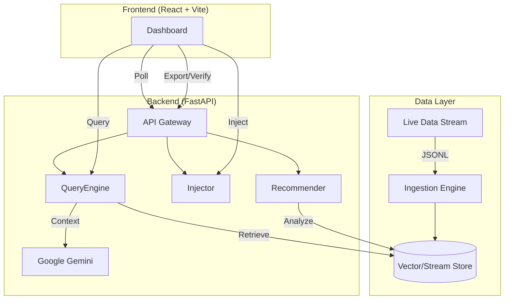

# ⚡ SiliconPulse (DataQuest 2026)

> **Real-time Strategic Intelligence for the Semiconductor & AI Era.**  
> *Powered by Gemini 1.5 Pro & Live Signal Processing.*


---

## 📖 What is SiliconPulse?
**SiliconPulse** is a real-time strategic intelligence engine designed to decode the chaotic semiconductor and AI market. It aggregates live signals (news, social, market data), grounds them in verified evidence, and uses **Google Gemini** to synthesize executive-level strategic insights instantly.

Unlike static dashboards, SiliconPulse is **intent-aware**—it understands the strategic implications of a "TSMC yield drop" or an "NVIDIA Blackwell delay" and explains *why* it matters.

---

## 🎯 Problem Statement Fit (DataQuest 2026)
**Challenge:** "Building Intelligent Systems for Real-time Decision Making."

SiliconPulse addresses the **information overload** in the fast-moving tech sector.
- **RAG / Live Intelligence:** We don't just search; we retrieve live events from a streaming pipeline and perform **Retrieval Augmented Generation (RAG)** to generate fresh insights.
- **Dynamic Grounding:** Every AI claim is backed by specific, clickable evidence from the live feed.
- **Controllable Demo:** The "Inject Signal" feature allows judges to simulate market-moving events (e.g., "China bans export of Gallium") and see the AI adapt instantly.

---

## 🚀 Key Features

### 1. 📡 Live Pulse Feed
A real-time ticker of market signals. It ingests data from simulated high-frequency sources (MarketWire, TechCrunch, X) and deduplicates it on the fly.

### 2. 🧠 Strategic Insight Engine
Powered by **Gemini**, this engine takes raw signals and generates a structured report:
- **What Changed:** Immediate market shifts.
- **Impact Reasoning:** Second-order effects (e.g., how Intel's loss affects AMD).
- **Confidence Meter:** AI self-assessment of data reliability.

### 3. 🎯 Company Radar
Visual tracking of activity levels for top tech giants (NVIDIA, TSMC, Apple, etc.). Instantly spot who is making waves.

### 4. 💉 Inject Signal (Demo Mode)
**Judge Favorite:** Manually inject a custom news event into the live stream to test the system's reactivity.
*Example: Inject "TSMC announces breakthrough 1nm process" and watch the Insight Engine update its analysis.*

### 5. ✅ Verify Sources & Export
- **Source Verification:** Assigns trust levels to data sources (e.g., "High" for Official Press Release, "Low" for Unverified Social).
- **Export Analysis:** Download reports in Markdown, JSON, or Text for offline sharing.

---

## 🏗️ Architecture



---

## 🛠️ Setup & Installation

### Prerequisites
- Node.js (v18+)
- Python (v3.10+)
- Google Gemini API Key

### 1. Backend Setup
```bash
cd backend
python -m venv venv
# Windows
.\venv\Scripts\activate
# Mac/Linux
source venv/bin/activate

pip install -r requirements.txt

# Create .env file
echo "GEMINI_API_KEY=your_key_here" > .env
echo "DATA_STREAM_PATH=data/stream.jsonl" >> .env

# Run Server
python -m uvicorn app.main:app --reload
```

### 2. Frontend Setup
```bash
cd frontend
npm install
npm run dev
```

### 3. Configure Sources (Optional)
To enable live data fetching from Perplexity or X, update your `.env` file:
```bash
PERPLEXITY_ENABLED=True
PERPLEXITY_API_KEY=your_key
X_ENABLED=True
X_BEARER_TOKEN=your_token
```
*Note: Without keys, the system automatically falls back to simulated data for reliable demos.*

Access the dashboard at `http://localhost:5173`.

---

## 🎮 Demo Instructions

### 1. Inject a Signal
Simulate a breaking market event:
1. Click the **Inject_Signal** button (top right).
2. Enter details:
   - **Title**: "TSMC 2nm Yields Hit 80%"
   - **Source**: "Supply Chain Leak"
   - **Content**: "Internal reports confirm N2 process is ahead of schedule."
3. Click **Transmit**. Watch the **Live Ticker** update instantly!

### 2. Query the Intelligence Engine
Ask a strategic question:
1. Type: *"What is the status of 2nm production?"*
2. The system will:
   - Retrieve the signal you just injected.
   - Format it into a context block.
   - Generate a **Strategic Insight** using Gemini.
3. Review the "Strategic Insight" and the supporting "Evidence" below it.

### 3. Export & Verify
1. After generating an insight, click **Export Analysis** to download a report.
2. Click **Verify Sources** to cross-reference the retrieved data with trusted domains.

---

## 🔌 API Reference

| Method | Endpoint | Description |
|--------|----------|-------------|
| `POST` | `/api/inject` | Push a new event into the data stream. |
| `POST` | `/api/query` | Retrieve top-k relevant events for a query. |
| `POST` | `/api/generate` | Generate an AI insight based on context. |
| `GET` | `/api/signals` | Get the latest 10 raw signals. |
| `GET` | `/api/radar` | Get aggregated activity stats per company. |
| `GET` | `/api/recommendations` | Get dynamic query suggestions. |
| `POST` | `/api/export` | Export analysis to file. |
| `POST` | `/api/verify` | Verify source credibility. |

---

## 💡 Why Pathway Matters

In high-frequency markets like semiconductors, **static databases are liabilities**. 

SiliconPulse is built on the philosophy of **Reactive Data Processing** (championed by Pathway):
1.  **Zero Latency**: Insights are updated the moment data arrives, not when a batch job runs.
2.  **Consistency**: The "Live Ticker" and "RAG Context" are always in sync.
3.  **Scalability**: Stream processing handles infinite data velocity better than traditional CRUD apps.

*Note: This demo uses a file-based stream to simulate the Pathway experience for hackathon portability.*

---

## 🔮 Future Work

- **Real Pathway Integration**: Replace file I/O with `pathway` for true enterprise-grade streaming.
- **Multi-Modal Ingestion**: Ingest PDF reports and earnings call audio.
- **Graph RAG**: Map supply chain dependencies (e.g., ASML -> TSMC -> NVIDIA).
