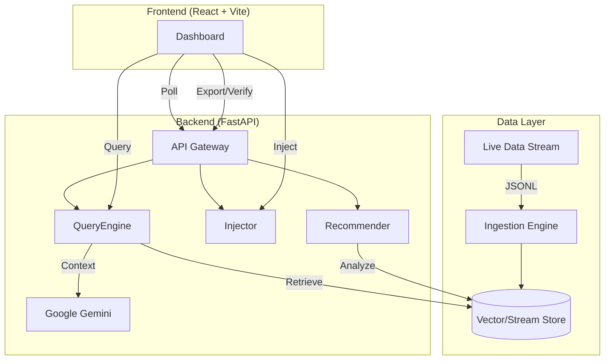

# ⚡ SiliconPulse

**Live Strategic Intelligence for the Semiconductor Industry**

SiliconPulse is a real-time RAG (Retrieval-Augmented Generation) engine designed to monitor, analyze, and predict market shifts in the semiconductor sector. By combining live data streams with Gemini's reasoning capabilities, it provides instant strategic insights for executives and analysts.

---

## 🚀 What It Does

- **Live Signal Ingestion**: Captures high-velocity market events (contracts, yields, launches) in real-time.
- **Dynamic RAG**: Instantly retrieves the most relevant context for any query, ensuring answers are never stale.
- **AI-Powered Insights**: Uses Google Gemini to synthesize scattered data points into executive-level briefings.
- **Competitor Radar**: Tracks activity levels across key players (NVIDIA, TSMC, Apple) to spot emerging threats.
- **Smart Recommendations**: Proactively suggests high-impact queries based on real-time market shifts.
- **Source Verification**: Verifies the credibility of intelligence sources using cross-referencing.
- **Exportable Intelligence**: Generates downloadable reports (PDF, Markdown, JSON) for offline analysis.

---

## 🏗️ Architecture



---

## 🛠️ Setup & Installation

### Prerequisites
- Node.js (v18+)
- Python (v3.10+)
- Google Gemini API Key

### 1. Backend Setup
```bash
cd backend
python -m venv venv
# Windows
.\venv\Scripts\activate
# Mac/Linux
source venv/bin/activate

pip install -r requirements.txt

# Create .env file
echo "GEMINI_API_KEY=your_key_here" > .env
echo "DATA_STREAM_PATH=data/stream.jsonl" >> .env

# Run Server
python -m uvicorn app.main:app --reload
```

### 2. Frontend Setup
```bash
cd frontend
npm install
npm run dev
```

### 3. Configure Sources (Optional)
To enable live data fetching from Perplexity or X, update your `.env` file:
```bash
PERPLEXITY_ENABLED=True
PERPLEXITY_API_KEY=your_key
X_ENABLED=True
X_BEARER_TOKEN=your_token
```
*Note: Without keys, the system automatically falls back to simulated data for reliable demos.*

Access the dashboard at `http://localhost:5173`.

---

## 🎮 Demo Instructions

### 1. Inject a Signal
Simulate a breaking market event:
1. Click the **Inject_Signal** button (top right).
2. Enter details:
   - **Title**: "TSMC 2nm Yields Hit 80%"
   - **Source**: "Supply Chain Leak"
   - **Content**: "Internal reports confirm N2 process is ahead of schedule."
3. Click **Transmit**. Watch the **Live Ticker** update instantly!

### 2. Query the Intelligence Engine
Ask a strategic question:
1. Type: *"What is the status of 2nm production?"*
2. The system will:
   - Retrieve the signal you just injected.
   - Format it into a context block.
   - Generate a **Strategic Insight** using Gemini.
3. Review the "Strategic Insight" and the supporting "Evidence" below it.

### 3. Export & Verify
1. After generating an insight, click **Export Analysis** to download a report.
2. Click **Verify Sources** to cross-reference the retrieved data with trusted domains.

---

## 🔌 API Reference

| Method | Endpoint | Description |
|--------|----------|-------------|
| `POST` | `/api/inject` | Push a new event into the data stream. |
| `POST` | `/api/query` | Retrieve top-k relevant events for a query. |
| `POST` | `/api/generate` | Generate an AI insight based on context. |
| `GET` | `/api/signals` | Get the latest 10 raw signals. |
| `GET` | `/api/radar` | Get aggregated activity stats per company. |
| `GET` | `/api/recommendations` | Get dynamic query suggestions. |
| `POST` | `/api/export` | Export analysis to file. |
| `POST` | `/api/verify` | Verify source credibility. |

---

## 💡 Why Pathway Matters

In high-frequency markets like semiconductors, **static databases are liabilities**. 

SiliconPulse is built on the philosophy of **Reactive Data Processing** (championed by Pathway):
1.  **Zero Latency**: Insights are updated the moment data arrives, not when a batch job runs.
2.  **Consistency**: The "Live Ticker" and "RAG Context" are always in sync.
3.  **Scalability**: Stream processing handles infinite data velocity better than traditional CRUD apps.

*Note: This demo uses a file-based stream to simulate the Pathway experience for hackathon portability.*

---

## 🔮 Future Work

- **Real Pathway Integration**: Replace file I/O with `pathway` for true enterprise-grade streaming.
- **Multi-Modal Ingestion**: Ingest PDF reports and earnings call audio.
- **Graph RAG**: Map supply chain dependencies (e.g., ASML -> TSMC -> NVIDIA).
