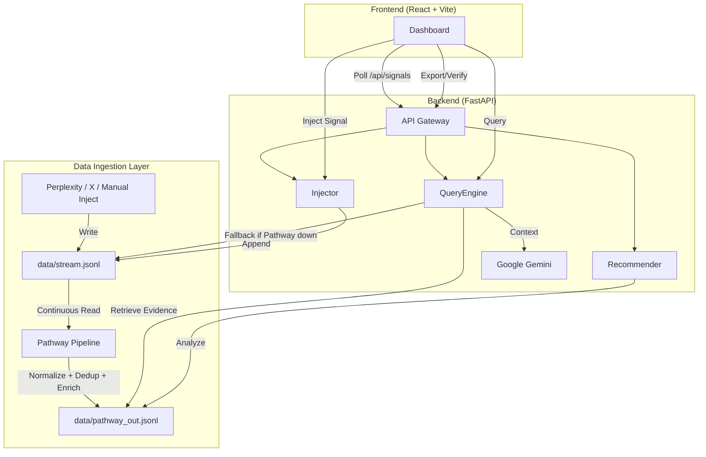

# ⚡ SiliconPulse (DataQuest 2026)

> **Real-time Strategic Intelligence for the Semiconductor & AI Era.**  
> *Powered by Gemini 1.5 Pro, Pathway Streaming & Live Signal Processing.*


---

## 📖 What is SiliconPulse?
**SiliconPulse** is a real-time strategic intelligence engine designed to decode the chaotic semiconductor and AI market. It aggregates live signals (news, social, market data), grounds them in verified evidence, and uses **Google Gemini** to synthesize executive-level strategic insights instantly.

Unlike static dashboards, SiliconPulse is **reactive and intent-aware**—it understands the strategic implications of a "TSMC yield drop" or an "NVIDIA Blackwell delay" and explains *why* it matters, backed by a dynamic confidence assessment.

---

## 🎯 Problem Statement Fit (DataQuest 2026)
**Challenge:** "Building Intelligent Systems for Real-time Decision Making."

SiliconPulse addresses the **information overload** in the fast-moving tech sector by implementing:
- **RAG / Live Intelligence:** We don't just search; we retrieve live events from a streaming pipeline and perform **Retrieval Augmented Generation (RAG)** to generate fresh insights.
- **Dynamic Grounding:** Every AI claim is backed by specific, clickable evidence from the live feed.
- **Real-time Reasoning:** The system adapts its analysis the moment a new signal is injected, providing up-to-the-minute strategic outlooks.
- **System Design:** A robust decoupled architecture with Pathway stream processing, FastAPI gateway, background schedulers, and a high-performance React frontend.

---

## 🚀 Key Features

### 1. 📡 Live Pulse Feed
A real-time ticker of market signals. It ingests data from simulated and live sources (Perplexity, X) and deduplicates it on the fly with a 12-hour freshness window.

### 2. 🧠 Strategic Insight Engine
Powered by **Gemini**, this engine takes raw signals and generates a structured report:
- **What Changed:** Immediate market shifts.
- **Impact Reasoning:** Second-order effects (e.g., how Intel's loss affects AMD).
- **Confidence Meter:** A dynamic assessment of data reliability based on evidence count, recency, and source trust.

### 3. 🎯 Company Radar
Visual tracking of activity levels for top tech giants (NVIDIA, TSMC, Apple, etc.). Instantly spot who is making waves in the current data stream.

### 4. 💉 Inject Signal (Demo Mode)
**Judge Favorite:** Manually inject a custom news event into the live stream to test the system's reactivity. Watch the AI adapt its analysis instantly.

### 5. ✅ Verify Sources & Export (End-to-End)
- **Source Verification**: Instantly verify the credibility of AI claims. The system assigns trust levels (e.g., "High" for Reuters/Bloomberg, "Low" for Unverified Social) and provides a specific reason for each trust score.
- **Multi-Format Export**: Download your strategic analysis in **Markdown**, **JSON**, or **Text**. Choose whether to include the raw evidence items for a complete audit trail.

### 6. 🎬 Cinematic UI
A premium, high-fidelity interface featuring a deep radial gradient, tech-grid overlay, and cyan/indigo atmospheric glows for a state-of-the-art "Command Center" feel.

---

## 🏗️ Architecture Overview

SiliconPulse uses a decoupled architecture designed for high-velocity data with **Pathway** as the real-time ingestion and processing layer.



### Request Flow:
1.  **Ingest**: Live sources (Perplexity, X) and manual injections write to `data/stream.jsonl`.
2.  **Process**: Pathway continuously reads the raw stream, normalizes data, deduplicates by `event_id`, enriches with company/event_type tags, and writes to `data/pathway_out.jsonl`.
3.  **Retrieve**: FastAPI's `QueryEngine` reads from the processed stream (with automatic fallback to raw stream if Pathway is unavailable).
4.  **Synthesize**: Evidence is passed to Gemini with a strategic prompt → Structured JSON report is generated.
5.  **Display**: Frontend polls `/api/signals` every 5s to update the live feed and displays insights.

---

## 🌊 Pathway Streaming Pipeline

SiliconPulse uses **Pathway** to provide an enterprise-grade real-time data processing layer, demonstrating applied AI system design for the DataQuest challenge.

### What is Pathway?
Pathway is a Python framework for high-throughput stream processing. In SiliconPulse, it serves as the **intelligent ingestion engine** that transforms raw market signals into clean, deduplicated, and enriched data ready for RAG retrieval.

### Why Pathway Matters for DataQuest:
- **Real-time System Design**: Demonstrates production-grade streaming architecture beyond simple file I/O.
- **Applied AI**: Combines rule-based enrichment (keyword tagging) with downstream LLM synthesis.
- **RAG Enhancement**: Clean, deduplicated data improves retrieval quality and reduces hallucination risk.
- **Scalability**: Pathway's streaming model is designed for continuous, high-velocity data—critical for real-world intelligence systems.

### Transformations Performed:
1. **Normalization**: Strips whitespace, lowercases text for consistent matching.
2. **Deduplication**: Computes a stable `event_id` (SHA256 hash of title + content + URL) to ensure each market event is processed only once, even if reported by multiple sources.
3. **Enrichment/Tagging**: 
   - Automatically identifies `company` (NVIDIA, TSMC, Intel, etc.) based on content keywords.
   - Tags `event_type` (product_launch, contract, supply_chain, m_and_a, financial) for structured analysis.
4. **Freshness Window**: Maintains a rolling 12-hour window of "live" signals for time-sensitive intelligence.
5. **Streaming Output**: Continuously writes processed records to `data/pathway_out.jsonl` in real-time.

### Integration with FastAPI:
- The backend's `safe_read_jsonl()` function checks the `USE_PATHWAY` environment variable.
- If enabled and `pathway_out.jsonl` exists, it reads from the processed stream.
- **Demo-Proof Fallback**: If Pathway is not running or the output file is empty, the system automatically falls back to `stream.jsonl`, ensuring zero downtime during demos.

---

## ⚙️ How to Run (Pathway Mode)

### Prerequisites
- **Python 3.11** (Required for Pathway compatibility)
- **Node.js 18+**
- **Google Gemini API Key**

### Step-by-Step Instructions

**Terminal 1: Start Pathway Pipeline**
```bash
cd backend
python pathway_pipeline.py
```
*You should see: "🚀 Starting Pathway Pipeline..." and continuous processing logs.*

**Terminal 2: Start FastAPI Backend**
```bash
cd backend
uvicorn app.main:app --reload --port 8000
```
*Backend will auto-detect `pathway_out.jsonl` and use it as the primary data source.*

**Terminal 3: Start React Frontend**
```bash
cd frontend
npm install  # First time only
npm run dev
```
*Frontend will be available at `http://localhost:5173`*

### Quick Start (Windows PowerShell Scripts)
We provide one-click scripts for convenience:

```powershell
# Terminal 1
cd backend
.\run_pathway.ps1

# Terminal 2
cd backend
.\run_backend.ps1

# Terminal 3
cd frontend
.\run_frontend.ps1
```

---

## ✅ Verification Steps

### 1. Verify Pathway Integration
```bash
cd backend
python test_pathway.py
```
**Expected Output:**
```
🧪 Starting Pathway Integration Test...
📡 Checking initial signals...
✅ Received 20 initial signals
💉 Injecting test signal: PATHWAY_TEST_SIGNAL_...
✅ Signal injected successfully
⏳ Waiting 5 seconds for Pathway processing...
📡 Verifying signal in feed...
✅ SUCCESS: Found processed signal in feed!
```

### 2. Check Backend Health
```bash
curl http://localhost:8000/health
```
**Expected:** `{"status": "healthy"}`

### 3. Verify Processed Signals
```bash
curl http://localhost:8000/api/signals
```
**Expected:** JSON array of signals with `event_id`, `company`, and `event_type` fields populated by Pathway.

---

## 🛠️ Tech Stack

- **Frontend**: React 18, Vite, Tailwind CSS, Lucide Icons, Framer Motion.
- **Backend**: FastAPI (Python 3.11), Uvicorn, APScheduler.
- **Stream Processing**: **Pathway** (Real-time ingestion, deduplication, enrichment).
- **AI/LLM**: Google Gemini 1.5 Flash (Primary) & 1.5 Pro (Fallback).
- **Data/Storage**: JSONL (Streaming format), SQLite (Deduplication & Metadata).
- **APIs**: Perplexity AI, X (Twitter) API.

---

## 📂 Folder Structure

```text
siliconpulse/
├── backend/
│   ├── app/
│   │   ├── routes.py       # API Endpoints
│   │   ├── models.py       # Pydantic Schemas
│   │   ├── services/       # Gemini Client
│   │   ├── sources/        # Perplexity & X Integrations
│   │   ├── utils.py        # Confidence & Signal Logic (Pathway fallback)
│   │   └── settings.py     # Environment Config (USE_PATHWAY)
│   ├── data/               
│   │   ├── stream.jsonl         # Raw signal stream
│   │   └── pathway_out.jsonl    # Processed stream (Pathway output)
│   ├── pathway_pipeline.py      # Pathway streaming logic
│   ├── test_pathway.py          # Integration verification script
│   └── run_*.ps1                # Quick-start scripts
├── frontend/
│   ├── components/         # UI Components (Radar, Insight, etc.)
│   ├── api/                # API Client (Axios)
│   └── App.tsx             # Main Dashboard Logic
└── README.md               # You are here
```

---

## 🔌 API Endpoints

| Method | Endpoint | Purpose |
|--------|----------|---------|
| `POST` | `/api/query` | Retrieve evidence & compute dynamic confidence. |
| `POST` | `/api/generate` | Synthesize strategic insight using Gemini. |
| `POST` | `/api/inject` | Manually push a signal into the live stream. |
| `GET` | `/api/signals` | Fetch the latest signals for the live feed. |
| `GET` | `/api/radar` | Get company activity levels for the radar UI. |
| `GET` | `/api/recommendations` | Get dynamic, context-aware query suggestions. |
| `POST` | `/api/export` | Download report in MD, JSON, or TXT format (supports `include_evidence` flag). |
| `GET` | `/api/sources/verify` | Verify source credibility, trust levels, and justifications for a query. |

---

## 📡 Real-Time / Streaming Functionality

SiliconPulse implements a **Reactive Intelligence Loop** powered by Pathway:

- **Pathway Continuous Processing**: The Pathway pipeline runs in streaming mode, continuously monitoring `stream.jsonl` for new events. When a new signal is detected (from scheduled pulls or manual injection), Pathway immediately processes it and updates `pathway_out.jsonl`.
  
- **Polling Mechanism**: The frontend refreshes the live feed every 5 seconds by calling `/api/signals`, ensuring the "Pulse" is always current.

- **Background Scheduler**: The backend runs a task every 5 minutes to pull fresh signals from Perplexity and X, which are written to `stream.jsonl` and automatically picked up by Pathway.

- **Inject Signal Reactivity**: When a user injects a custom signal via the UI:
  1. Signal is appended to `stream.jsonl`
  2. Pathway detects the new line and processes it (normalize, dedup, enrich)
  3. Processed signal appears in `pathway_out.jsonl` within seconds
  4. Next query or feed refresh immediately includes the enriched signal

- **Deduplication**: Pathway's `event_id` fingerprinting ensures that duplicate news items from different sources are merged, preventing redundant analysis.

---

## 🎮 Demo Instructions (For Judges)

Follow this 3-minute pipeline to see SiliconPulse + Pathway in action:

1.  **Start the System**: Ensure Pathway, Backend, and Frontend are running (see "How to Run" above).
2.  **Verify Pathway**: Run `python test_pathway.py` to confirm the streaming pipeline is active.
3.  **Explore Recommendations**: Click a recommended query like *"NVIDIA-TSMC Pipeline"* to see instant RAG retrieval from the processed stream.
4.  **Analyze Insight**: Review the **Strategic Insight** report. Note the **Confidence Meter**—it explains *why* the AI trusts the data.
5.  **Inject a Signal**: 
    - Click **Inject Signal** (top right).
    - Title: `China restricts Neon exports to TSMC`
    - Content: `New export controls targeting semiconductor raw materials.`
    - Click **Transmit**.
6.  **Observe Pathway Processing**: Wait 2-3 seconds. Check the live feed—the injected signal should appear with auto-tagged `company: TSMC` and `event_type: supply_chain`.
7.  **Re-Query**: Search for *"Neon supply"* or *"TSMC supply chain"*. The AI will now incorporate the injected signal into its "Impact Reasoning" and "Strategic Outlook", demonstrating real-time RAG.
8.  **Verify & Export**: Click **Verify Sources** to see trust levels, then **Export Analysis** to save the report.

---

## 🔗 Submission Links
- **GitHub Repo**: [SiliconPulse Repository](https://github.com/SanskarG-20/SiliconPulse---DataQuest-2026)
- **Demo Video**: [Loom/Drive Link Placeholder]

---

## 👥 Team & Credits
- **Team Apex** (DataQuest 2026)
- Built with ❤️ using Google Gemini, Pathway & FastAPI.

---

## 🔮 Future Scope
- **Graph RAG**: Mapping complex supply chain dependencies (e.g., ASML -> TSMC -> NVIDIA) for deeper impact analysis.
- **Multi-Modal Ingestion**: Processing PDF earnings reports and financial charts directly.
- **Distributed Pathway**: Scaling to multiple Pathway workers for enterprise-grade throughput (1M+ events/day).
