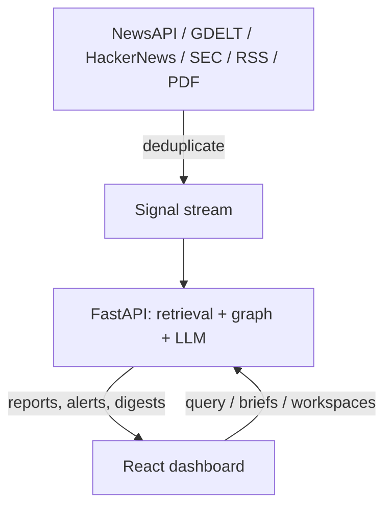

# SiliconPulse

**Real-time strategic intelligence for the semiconductor and AI supply chain.**

SiliconPulse ingests live market signals, deduplicates them, and uses Google Gemini to synthesize evidence-backed executive briefings with supply-chain graph context — what changed, why it matters, and what to watch next.

   

## Overview

SiliconPulse is a full-stack intelligence engine:

- **Backend** — FastAPI + APScheduler + SQLite, with Clerk JWT auth, rate limiting, and `/health`, `/ping`, `/metrics` observability.
- **Ingestion** — GDELT, HackerNews, NewsAPI, SEC filings (Finnhub + EDGAR), custom RSS feeds, and PDF uploads, all deduplicated into a single signal stream.
- **Intelligence** — Hybrid keyword + vector retrieval over a supply-chain knowledge graph, synthesized by Gemini into structured, confidence-scored reports.
- **Frontend** — React dashboard with live feed, evidence-backed reports, graph explorer, scenario simulation, team workspaces, and shareable briefs.

The system degrades gracefully: without API keys it falls back to keyword search and simulation-mode reports instead of failing.

## Key Features

- **Live signal pipeline** — Continuous ingestion with SHA-256 dedup, 12-hour freshness window, and scheduled pulls.
- **Hybrid search** — Keyword alias expansion merged with `gemini-embedding-001` vector search (Supabase pgvector, Chroma fallback).
- **Supply-chain Graph RAG** — Company dependency graph (e.g. ASML → TSMC → NVIDIA) with impact/supplier analysis and what-if shock simulation.
- **Evidence-backed briefings** — Every claim links to timestamped sources with trust levels and confidence scoring.
- **Head-to-head comparison** — Side-by-side analysis of up to 4 companies with shared-exposure detection.
- **Trend detection** — Daily signal timelines with statistical spike alerts.
- **Team collaboration** — Workspaces with shared watchlists, shareable brief links (`/b/:id`), discussion threads, and Slack/Discord alerts.
- **Scheduled digests** — Morning briefings delivered by email or webhook.
- **Ingestion options** — PDF upload with table extraction, SEC 8-K pipeline, custom RSS feeds, and manual signal injection.
- **Programmatic access** — API keys (`X-API-Key`) for bots and CI, plus Markdown/JSON/Text/PDF export.

## Architecture


```mermaid
graph TD
    Sources[NewsAPI / GDELT / HackerNews / SEC / RSS / PDF] -->|deduplicate| Stream[Signal stream]
    Stream --> Backend[FastAPI: retrieval + graph + LLM]
    Backend -->|reports, alerts, digests| App[React dashboard]
    App -->|query / briefs / workspaces| Backend
```

- **Retrieval:** keyword + vector hybrid over the signal stream, enriched with graph context.
- **Graph:** in-memory supply-chain DAG with BFS impact scoring and shock propagation.
- **Live updates:** SWR polling with WebSocket push; background scheduler handles ingestion, digests, and alerts.

## Tech Stack

| Layer | Technologies |
|-------|--------------|
| Frontend | React 19, Vite 6, Tailwind, React Router, SWR, Clerk, Playwright, nginx |
| Backend | FastAPI, Uvicorn, Pydantic, APScheduler, slowapi, PyJWT |
| AI | Google Gemini (generation + embeddings), PyMuPDF |
| Storage | JSONL stream, SQLite, Chroma / Supabase pgvector, Supabase (users, briefs, workspaces) |
| Infra | Docker Compose, Redis (rate limiting, queues), GitHub Actions CI |

## Setup

**Prerequisites:** Python 3.11, Node.js 20, a [Clerk](https://dashboard.clerk.com) project, a [Gemini API key](https://aistudio.google.com/apikey), and (recommended) a [Supabase](https://supabase.com) project.

```bash
git clone https://github.com/SanskarG-20/SiliconPulse.git
cd SiliconPulse
cp .env.example .env   # then fill in required keys below

# Backend
cd backend
python -m venv venv
# Windows: .\venv\Scripts\Activate.ps1
# Linux/macOS: source venv/bin/activate
pip install -r requirements.txt

# Frontend (new terminal)
cd frontend
npm ci
```

### Environment

| Variable | Required | Purpose |
|----------|----------|---------|
| `GEMINI_API_KEY` | Yes | Report generation + embeddings |
| `CLERK_ISSUER`, `CLERK_AUDIENCE`, `VITE_CLERK_PUBLISHABLE_KEY` | Yes | Authentication |
| `SUPABASE_URL`, `SUPABASE_SERVICE_ROLE_KEY` | Recommended | Persistence, history, sharing, workspaces |
| `VITE_API_BASE_URL` | Prod | Backend URL (default `http://127.0.0.1:8000/api`) |
| `NEWSAPI_API_KEY`, `FINNHUB_API_KEY`, `YOUTUBE_API_KEY` | No | Extra sources + videos |
| `RESEND_API_KEY` | No | Digest emails |
| `REDIS_URL` | No | Distributed rate limiting / queues |
| `FRESHNESS_HOURS`, `MAX_EVENTS_TO_SCAN` | No | Retrieval tuning (defaults `12`, `500`) |

> Never commit `.env`. Only `VITE_*` variables are bundled into the client.

### Running

```bash
# Terminal 1 — backend (includes background scheduler)
cd backend
.\run_backend.ps1              # Windows
# uvicorn app.main:app --reload --port 8000   # Linux/macOS

# Terminal 2 — frontend at http://localhost:3000
cd frontend
npm run dev
```

Or with Docker: `docker compose up --build` (frontend `:3000`, backend `:8000`, Redis `:6379`).

On Windows, Pathway streaming is auto-disabled and the scheduler handles ingestion. Health: `curl http://localhost:8000/health`.

## Usage

1. **Ask** — Enter a query (e.g. “TSMC N2 yield”) or pick a suggested directive.
2. **Review** — Read the confidence-scored report with linked evidence; filter by source trust.
3. **Explore** — Open the supply-chain graph, run scenario shocks, or compare companies head-to-head.
4. **Act** — Export to PDF/Markdown, share a brief link, pin companies to your watchlist, or schedule a morning digest.

Apply the SQL in `supabase/migrations/` (via the Supabase SQL Editor) to enable history, sharing, workspaces, digests, and integrations.

## API Overview

Base URL `http://localhost:8000` (interactive docs at `/docs`). All `/api/*` routes accept a Clerk JWT (`Authorization: Bearer …`); most also accept an API key (`X-API-Key` or `?api_key=`). Public endpoints: `/health`, `/ping`, `/metrics`, shared briefs, and brief comments.

| Area | Endpoints |
|------|-----------|
| Intelligence | `POST /api/query`, `POST /api/generate`, `POST /api/compare`, `GET /api/radar`, `GET /api/trends` |
| Graph | `GET /api/graph/nodes\|edges\|impact\|suppliers\|explain`, `POST /api/graph/simulate` |
| Ingestion | `POST /api/ingest/pdf`, `POST /api/ingest/sec`, `POST /api/inject`, `GET/POST/DELETE /api/rss` |
| Collaboration | `POST /api/briefs/share`, `GET /api/briefs/public/:id`, brief comments, `/api/workspaces*` |
| Personal | `/api/watchlist*`, `/api/history/*`, `/api/digest/*`, `/api/keys`, `/api/webhooks`, `/api/videos` |
| Realtime | `GET /api/signals`, `WS /api/ws/signals?token=JWT` |

## Testing

```bash
cd backend
$env:PYTHONPATH="."           # PowerShell (bash: export PYTHONPATH=".")
pytest tests/ -v

cd ../frontend
npx tsc --noEmit              # typecheck
npm run test                  # Vitest unit tests
npm run build                 # production build
npm run e2e                   # Playwright (spawns backend + frontend automatically)
```

CI (`.github/workflows/ci.yml`) runs backend tests, frontend typecheck/unit/build, and Playwright E2E on pushes and PRs to `main`/`develop`.

## Deployment

- **Docker Compose** (production-like): `cp .env.example .env`, fill keys, `docker compose up --build`.
- **Render (backend) + Vercel (frontend)** (recommended): set all env vars from `.env.example`; use `GET /ping` with UptimeRobot (5 min) to prevent free-tier sleep; set `VITE_API_BASE_URL` to the Render URL and redeploy. A missing `VITE_CLERK_PUBLISHABLE_KEY` shows a `Deployment Configuration Error` — add it in Vercel and redeploy.

## Contributing

1. Fork and branch from `main`.
2. `cp .env.example .env` and fill required keys; never commit `.env`.
3. Match existing style (`ruff` for Python, `eslint` + `tsc` for frontend) and add tests for new behavior (`backend/tests/`, frontend Vitest/`e2e/`).
4. Open a PR against `develop` (or `main` for hotfixes); ensure `pytest` and `npm run build` pass.

## License

MIT — see `LICENSE` if present. If no `LICENSE` file is committed, all rights are reserved to the repository owner.
